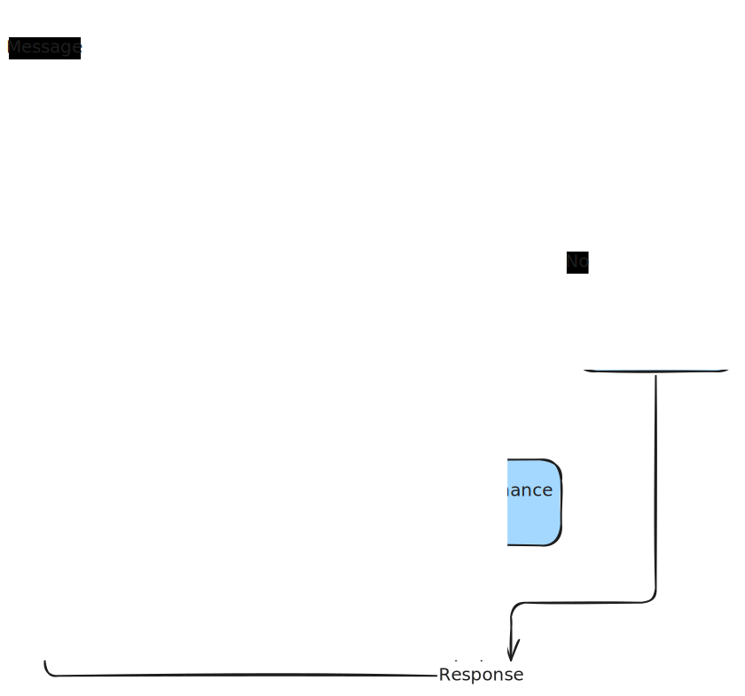

# Multi-Agent Chat

## Table of Contents

* [Overview](#overview)
* [Features](#features)
* [Architecture Diagram](#architecture-diagram)
* [Technical Decisions & Reasoning](#technical-decisions--reasoning)
* [Process & Task Approach](#process--task-approach)
* [Installation](#installation)
* [Setup & Configuration](#setup--configuration)
* [Usage](#usage)
* [Examples](#examples)

## Overview

This project implements a multi-agent chat interface using the OpenAI Agents SDK. The system allows users to interact with a set of specialized agents through a chat interface built with Next.js and TypeScript. Each agent has a dedicated role, such as input classification, database interaction, or general finance knowledge, and messages are routed accordingly.

## Features

* Chat interface built with Next.js and React (v0 UI)
* Multi-agent architecture using OpenAI Agents SDK
* Input Guardrail Agent to filter finance-related prompts
* Orchestrator Agent to coordinate responses
* DB Agent integrated with Prisma to retrieve user-specific data
* General Finance Agent for static finance Q\&A
* Backend communication using tRPC
* User model stored in a PostgreSQL database via Prisma

## Architecture Diagram

<p align="center">
  
</p>


## Technical Decisions & Reasoning

* **Next.js with TypeScript**: Chosen for ease of building full-stack applications with modern React features.
* **tRPC**: Enables type-safe, end-to-end communication between frontend and backend.
* **Prisma**: Provides a type-safe and flexible ORM to manage the User model. For demo purposes, SQLite was used as the database to simplify local setup and testing.
* **OpenAI Agents SDK**: Abstracts the complexity of managing multi-agent logic and message routing.
* **Agent design**: Modularity of agents allows for separation of concerns and easier scalability.

## Process & Task Approach

1. Initialized project with Next.js and configured TypeScript and ESLint.
2. Set up Prisma schema and database connection.
3. Built basic tRPC backend and defined User procedures.
4. Created chat interface with message send/receive support.
5. Implemented Input Guardrail Agent to classify prompts.
6. Developed Orchestrator Agent to route messages to:

   * DB Agent: Fetch user data from the Prisma DB.
   * General Finance Agent: Answer common finance questions.
7. Connected all parts through the tRPC API and validated agent routing.

## Installation

```bash
npm install
```

## Setup & Configuration

1. Create a `.env` file with the following environment variables:

```
DATABASE_URL=file:.../prisma/dev.db
OPENAI_API_KEY=sk-...
```

2. Set up the database:

```bash
npx prisma generate
npx prisma migrate dev --name init
```

## Usage

To run the development server:

```bash
npm run dev
```

Visit [http://localhost:3000](http://localhost:3000) to open the app.

## Examples

### Example 1:

**Prompt:** What is compound interest?
**Response:** Compound interest is the process where interest is added to the principal so that the added interest also earns interest...

### Example 2:

**Prompt:** Show me my user profile
**Response:** Here's your profile: Name: John Doe, Email: [john@example.com](mailto:john@example.com)

### Example 3:

**Prompt:** What are the latest stock prices?
**Response:** I'm sorry, I cannot access real-time data. I can help explain how stocks work though.
